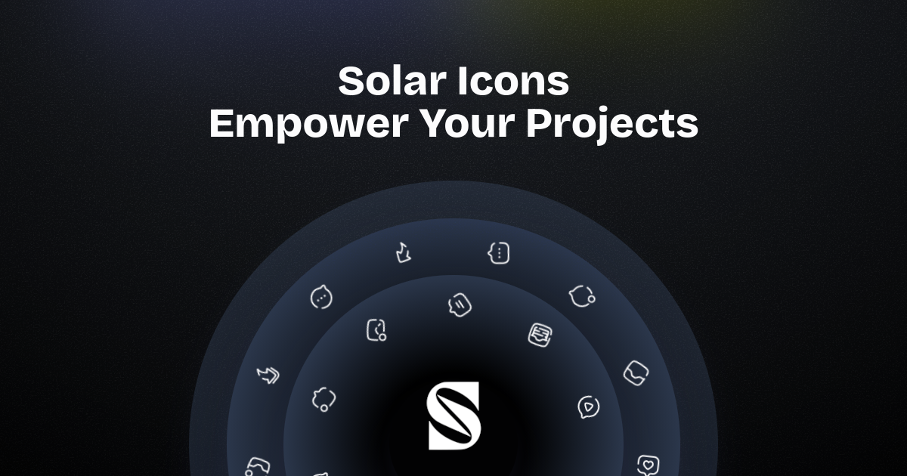

[](https://solar-icons.vercel.app)


# Solar Icons

**1,200+ unique icons. 6 styles each. Multiple frameworks. One flexible library.**

Solar Icons is a modern, multi-style icon set built for the web and mobile era — designed to be **modular**, **adaptable**, and **a joy to use**.  
Whether you want rich theming with global providers or the lightest possible bundle, Solar Icons fits right in.

🔗 **Explore the icons & docs:** [solar-icons.vercel.app](https://solar-icons.vercel.app)

---

## ✨ Why Solar Icons?

- **Massive Collection** → 1,246 icons × 6 styles = **7,476 variations**  
- **Consistent Multi-Style Design** → Bold, Linear, Outline, BoldDuotone, LineDuotone, Broken  
- **Multi-Framework Support** → React, Vue, Nuxt, React Native
- **DX Features** → IntelliSense previews, JSDoc hints, category imports, global config  
- **Smart Search** → AI-generated tags for better discoverability  
- **Performance Options** → Choose between full-featured and lightweight builds  

---

## 📦 Available Packages

| Package                | Description |
|------------------------|-------------|
| **`@solar-icons/react`**      | Full React integration with global provider, hooks, and live theming |
| **`@solar-icons/react-perf`** | Lightweight React build, tree-shakeable, no runtime provider |
| **`@solar-icons/react-native`**| Native SVG icons for React Native and Expo with multiple import strategies |
| **`@solar-icons/vue`**        | Vue adaptation of the React package with the same rich features |
| **`@solar-icons/nuxt`**       | Nuxt-optimized wrapper with auto-import, `nuxi` install, global config |

---

## 🛠 Quick Install

```sh
# Example: React
npm install @solar-icons/react
```

For Nuxt users:  
```sh
nuxi module add @solar-icons/nuxt
```

---

## 🔍 Explore & Play

- Browse all icons by category  
- Search with AI-powered keywords  
- Preview in different **sizes**, **colors**, and **styles**  
- Copy ready-to-use code snippets for your framework  
- Download icons as SVG instantly  

👉 Try it here: **[solar-icons.vercel.app/icons](https://solar-icons.vercel.app/icons)**

---

## 📜 License

- **Code:** MIT  
- **Icons:** CC BY 4.0 by [480 Design](https://www.figma.com/community/file/1166831539721848736) (commercial use allowed with attribution)  

---

## 💡 Credits

- **480 Design** → Original Solar icon set  
- **Phosphor Icons** & **Lucide Icons** → Inspiration for structure & tooling  

---
