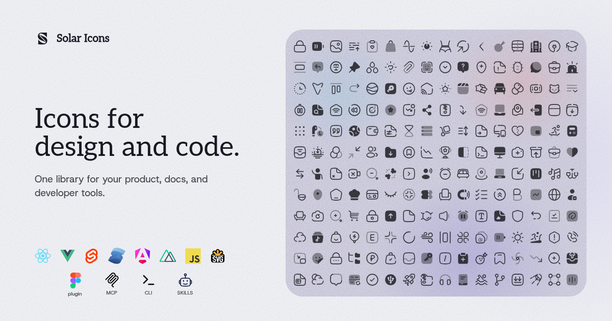

[](https://solar-icons.vercel.app)

# Solar Icons

Solar Icons is a single icon catalogue for product interfaces, documentation, and developer tools: 1,380 icons, each available in six styles, with the same collection distributed across frameworks, Figma, SVG assets, the CLI, and MCP.

[Browse the catalogue](https://solar-icons.vercel.app) · [Read the documentation](https://solar-icons.vercel.app/docs/v2) · [Install the Figma plugin](https://www.figma.com/community/plugin/1664759238792120976)

## Why Solar Icons

- Six styles for the same icon set: `Linear`, `Broken`, `Outline`, `Bold`, `LineDuotone`, and `BoldDuotone`.
- Framework packages with typed components and tree-shakeable imports.
- Shared controls for size, color, stroke width, and duotone colors.
- Framework-free SVG, sprite, ESM, and vanilla JavaScript options.
- The same catalogue is available in Figma and through developer tooling.

## Packages

| Package | npm | Use it for |
| --- | --- | --- |
| [`@solar-icons/react`](https://www.npmjs.com/package/@solar-icons/react) | [](https://www.npmjs.com/package/@solar-icons/react) | React and TypeScript components |
| [`@solar-icons/react-native`](https://www.npmjs.com/package/@solar-icons/react-native) | [](https://www.npmjs.com/package/@solar-icons/react-native) | React Native and Expo components |
| [`@solar-icons/vue`](https://www.npmjs.com/package/@solar-icons/vue) | [](https://www.npmjs.com/package/@solar-icons/vue) | Vue 3 components |
| [`@solar-icons/nuxt`](https://www.npmjs.com/package/@solar-icons/nuxt) | [](https://www.npmjs.com/package/@solar-icons/nuxt) | Nuxt 3 module |
| [`@solar-icons/svelte`](https://www.npmjs.com/package/@solar-icons/svelte) | [](https://www.npmjs.com/package/@solar-icons/svelte) | Svelte 5 components |
| [`@solar-icons/solid`](https://www.npmjs.com/package/@solar-icons/solid) | [](https://www.npmjs.com/package/@solar-icons/solid) | SolidJS components |
| [`@solar-icons/angular`](https://www.npmjs.com/package/@solar-icons/angular) | [](https://www.npmjs.com/package/@solar-icons/angular) | Angular standalone components |
| [`@solar-icons/static`](https://www.npmjs.com/package/@solar-icons/static) | [](https://www.npmjs.com/package/@solar-icons/static) | SVG files, sprite, metadata, and ESM strings |
| [`@solar-icons/js`](https://www.npmjs.com/package/@solar-icons/js) | [](https://www.npmjs.com/package/@solar-icons/js) | Vanilla JavaScript DOM injection |
| [`@solar-icons/codemod`](https://www.npmjs.com/package/@solar-icons/codemod) | [](https://www.npmjs.com/package/@solar-icons/codemod) | Opt-in migrations from v1 to v2 |
| [`@solar-icons/cli`](https://www.npmjs.com/package/@solar-icons/cli) | [](https://www.npmjs.com/package/@solar-icons/cli) | Search, inspect, and export icons from the terminal |
| [`@solar-icons/mcp`](https://www.npmjs.com/package/@solar-icons/mcp) | [](https://www.npmjs.com/package/@solar-icons/mcp) | Search and retrieve icons through MCP |

## Start with React

```sh
npm install @solar-icons/react
```

```tsx
import { HomeIcon } from '@solar-icons/react/linear'

export function Example() {
    return <HomeIcon size={24} strokeWidth={1.5} />
}
```

Each style has its own import path. See the [React guide](https://solar-icons.vercel.app/docs/v2/packages/react) for providers, CSS variables, and duotone settings. For other frameworks, choose the matching package above or browse the [package documentation](https://solar-icons.vercel.app/docs/v2/packages).

## Tools

- **Figma plugin:** Browse the catalogue and insert the same SVG assets used by the packages. [Install it from Figma](https://www.figma.com/community/plugin/1664759238792120976).
- **CLI:** Search, inspect, list, and export icons locally. See [`@solar-icons/cli`](packages/cli/README.md).
- **MCP:** Expose icon search and retrieval to MCP-compatible clients. See [`@solar-icons/mcp`](packages/mcp/README.md).
- **Agent Skill:** Give an agent a searchable Solar Icons catalogue with [`skills/solar-icons/SKILL.md`](skills/solar-icons/SKILL.md).

```sh
npx skills add saoudi-h/solar-icons --skill solar-icons
npx @solar-icons/cli search "home" --limit 10 --json
```

The documentation site also provides [`/llms.txt`](https://solar-icons.vercel.app/llms.txt) and [`/llms-full.txt`](https://solar-icons.vercel.app/llms-full.txt) for tools that work better with plain-text documentation.

## Migration from v1

Run the [codemod](https://solar-icons.vercel.app/docs/v2/migration-to-v2/codemod) to migrate supported imports and component names. It previews changes before writing files and reports cases that need manual review.

## License

- **Code:** MIT
- **Icons:** [CC BY 4.0](https://creativecommons.org/licenses/by/4.0/) by [480 Design](https://www.figma.com/community/file/1166831539721848736). Attribution is required.

## Credits

- **480 Design:** Original Solar icon set.
- **Phosphor Icons** and **Lucide Icons:** Inspiration for the package structure.
